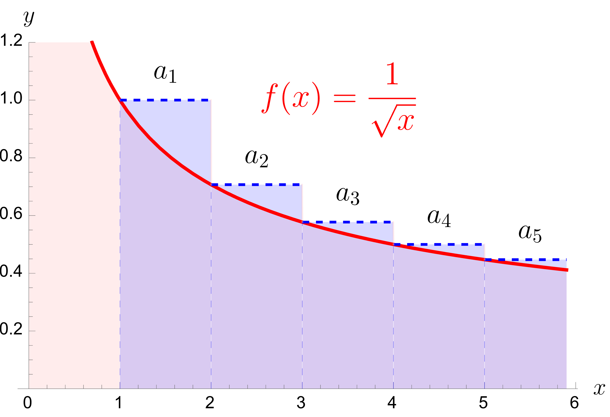
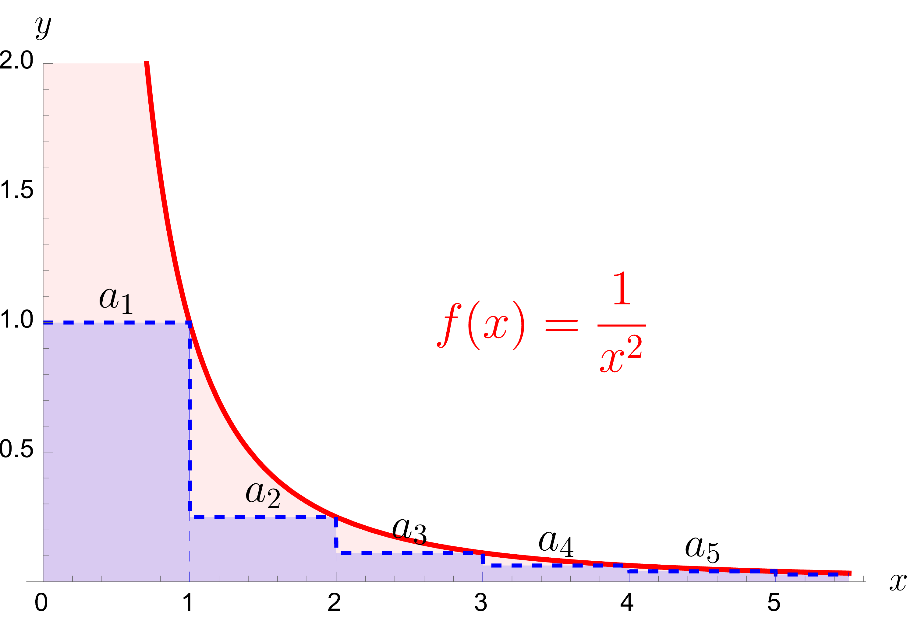

::: {#thm-integral} 
## Integral test

Let $f:[1,\infty)\to \mathbb{R}_+$ be a continuous non-increasing function with the property that
$$
\lim_{x\to\infty} f(x)=0.
$$
Define the sequence $\{a_n\}_{n=1}^\infty$ by $a_n=f(n)$. Then:

(a) If $\displaystyle\int_1^\infty f(x)\,dx=\infty$, then $\displaystyle \sum_{n=1}^\infty a_n=\infty$.

(b) If $\displaystyle\int_1^\infty f(x)\,dx=L<\infty$, then $\displaystyle \sum_{n=1}^\infty a_n$ is convergent.
:::

A proof is illustrated by the following two examples.

::: {#exm-diverg-inttest}

Consider the series $$\sum_{n=1}^\infty \frac{1}{\sqrt{n}}.$$
Then this is the series corresponding to $f(x)=\frac{1}{\sqrt{x}}$ which is decreasing and $\displaystyle \lim_{x\rightarrow\infty}f(x)=0$.

{#fig-int_test-div width=50%}

The total area of all the blocks is larger than the area between the graph of $f$ and the $x$-axes. This area is given by 
$$\int_1^\infty f(x)dx=\infty.$$
Therefore the series must diverge.
:::

::: {#exm-conv-inttest}
Consider the series $$\sum_{n=1}^\infty \frac{1}{\sqrt{n}}.$$
Then this is the series corresponding to $f(x)=\frac{1}{{x}^2}$ which is decreasing and $\displaystyle \lim_{x\rightarrow\infty}f(x)=0$.

{#fig-int_test-conv width=50%}

The total area of all the blocks is smaller than $a_1$ plus the area between the graph of $f$ and the $x$-axes on $I=1,\infty)$. This area is given by 
$$\int_1^\infty f(x)dx=\left[ -\frac{1}{x}\right]_1^\infty=1<\infty.$$
Therefore the sequence of partial sums is increasing and bounded, so it must converge.
:::

You are invited to write down a general proof. The answer you can always find below. 

::: {.callout-tip title="Proof" collapse="true"}
(a) Let $k\in\mathbb{N}$ and $x\in[k,k+1]$. Since $f$ is non-increasing, we have $a_k=f(k)\ge f(x)$, hence
$$
a_k \ge \int_k^{k+1} f(x)\,dx.
$$
Therefore,
$$
\sum_{k=1}^\infty a_k \ge \int_1^\infty f(x)\,dx=\infty.
$$

(b) Let $k\in\mathbb{N}$ and $x\in[k,k+1]$. Since $f$ is non-increasing, we have $f(x)\ge f(k+1)=a_{k+1}$, hence
$$
\int_k^{k+1} f(x)\,dx \ge a_{k+1}.
$$
Summing from $k=1$ to $n-1$ gives
$$
\int_1^{n} f(x)\,dx \ge \sum_{k=2}^{n} a_k.
$$
So for the partial sums $s_n=\sum_{k=1}^n a_k$,
$$
s_n = a_1 + \sum_{k=2}^n a_k \le a_1 + \int_1^{n} f(x)\,dx \le a_1 + \int_1^\infty f(x)\,dx.
$$
All terms $a_k$ are nonnegative, so $(s_n)$ is increasing, and the inequality above shows it is bounded. Hence $(s_n)$ converges, so $\sum_{n=1}^\infty a_n$ converges.
:::

A direct application is the following.

::: {#thm-integral-pol} 
The series $\displaystyle\sum_{n=1}^\infty \frac{1}{n^r}$ is convergent if and only if $r>1$.
:::

::: {.callout-tip title="Proof" collapse="true"}
Try to prove it yourself. Calculate the integral $\displaystyle \int_1^\infty \frac{1}{x^r}\,dx$ and conclude.
:::
